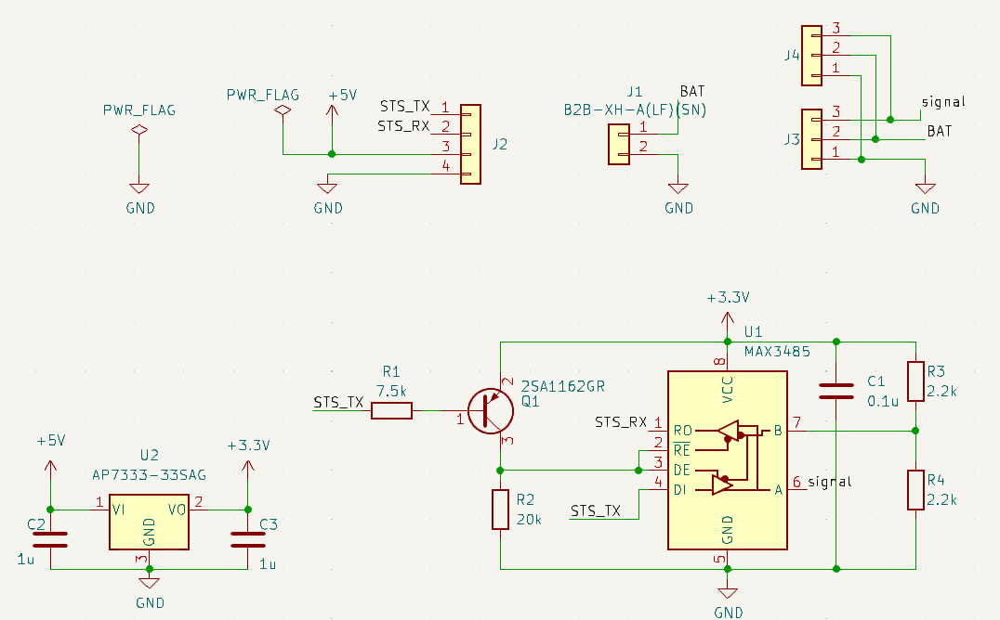

# Feetech STS interface board for M5Stack

## About
M5StackからFeetech STSシリーズのシリアルサーボを操作するためのオリジナル基板です．FE-URT-1([秋月リンク](https://akizukidenshi.com/catalog/g/gM-16295/))のUART機能のみを取り出して実装したため，同基板と比較して小型に収まっています．

## Usage
配線と動作の様子はこちら．
<iframe width="560" height="315" src="https://www.youtube.com/embed/_5FpvqL4ExI?si=2zxJVe1hsMPIyfzJ" title="YouTube video player" frameborder="0" allow="accelerometer; autoplay; clipboard-write; encrypted-media; gyroscope; picture-in-picture; web-share" allowfullscreen></iframe>

動作確認用にM5Stack向けのサンプルコードをm5stack_uart_feetech_stsのリポジトリ（[リンク
](https://github.com/kim-xps12/m5stack_uart_feetech_sts/)）にて公開しています．よろしければご利用ください．

## schematics

## BOM
| Symbol | Model Number |URL, Values|
| --- | --- | --- |
| Q1  | 2SA1162GR  | [https://akizukidenshi.com/catalog/g/gI-02702/](https://akizukidenshi.com/catalog/g/gI-02702/)  |
| U1  | MAX3485ED  | [https://akizukidenshi.com/catalog/g/gI-16211/](https://akizukidenshi.com/catalog/g/gI-16211/)  |
| U2  | AP7333  | [https://akizukidenshi.com/catalog/g/gI-11360/](https://akizukidenshi.com/catalog/g/gI-11360/)  |
| J1  | JST B4B-PH-K-S(LF)(SN) | [https://www.sengoku.co.jp/mod/sgk\_cart/detail.php?code=4DK2-SDDB](https://www.sengoku.co.jp/mod/sgk_cart/detail.php?code=4DK2-SDDB)  |
| J2  | JST B2B-XH-A(LF)(SN) | [https://akizukidenshi.com/catalog/g/gC-12247/](https://akizukidenshi.com/catalog/g/gC-12247/)  |
| J3  | Molex 5267-03A-X | [https://www.sengoku.co.jp/mod/sgk\_cart/detail.php?code=EEHD-0HWA](https://www.sengoku.co.jp/mod/sgk_cart/detail.php?code=EEHD-0HWA)  |
| R   | 0608 inch / 1608 jis metric | R1=7.5k, R2=20k, R3=R4=2.2k |
| C   | 0608 inch / 1608 jis metric | C1=0.1 u, C2=C3=1u |

## Distribution
本基板（部品未実装）はboothで頒布中です．よろしければご利用ください．
https://b-sky-lab.booth.pm/items/5083992

## Reference
Feetechインターフェースボード回路図
https://akizukidenshi.com/download/ds/akizuki/feetech_digital_servo_20220729.pdf

## Disclaimer
MITライセンスでの公開です．本設計および頒布した基板において生じた一切の損害等について作者は責任を負いません．予めご了承ください．
